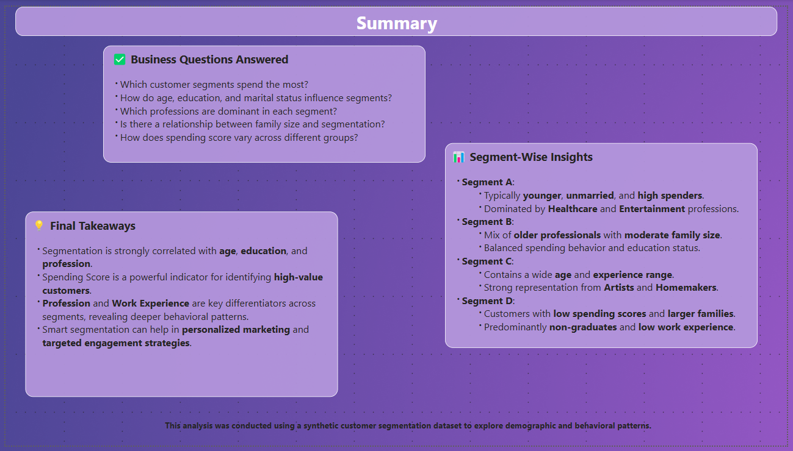

# 📊 Customer Segmentation Analysis Report

This Power BI dashboard analyzes customer segmentation using demographic, professional, and behavioral data. The insights can assist businesses in developing more targeted marketing strategies and understanding customer behavior patterns.

---

## 📁 Project Structure

```
Customer_Segmentataion_Analysis_Report/
│
├── data/
│ └── Train.csv
│
├── images/
│ ├── 1.Customer Overview.png
│ ├── 2.Customer Demographic Overview.png
│ ├── 3.Work Experience Trends Across Professions.png
│ ├── 4.Customer Spending Overview.png
│ ├── 5.Family Size & Category Overview.png
│ ├── 6.Smart Insights Overview Page 1.png
│ ├── 7.Smart Insights Overview Page 2.png
│ └── 8.Summary.png
│
├── Customer_Segments_Callsification_Report.pbix
└── Report_Structure.md
```


---

## 📌 Key Objectives

- Understand customer demographics across various segments.
- Analyze work experience and profession-wise trends.
- Explore spending behavior and family size influence.
- Deliver smart insights for targeted business strategies.

---

## 📷 Report Pages (Screenshots)

## 📷 Report Pages (Screenshots)

| Page | Overview |
|------|----------|
|  | **Customer Overview**: Segment distribution by demographics |
|  | **Demographics**: Age bins, family size, and profession |
|  | **Work Experience**: Profession-based trends |
|  | **Spending Patterns**: Spending Score and segmentation |
|  | **Family Size & Category**: Analysis by Var_1 and family size |
|  | **Smart Insights (1)**: Outlier & scatterplot analysis |
|  | **Smart Insights (2)**: Decomposition Tree |
|  | **Summary**: Questions answered, segment-wise insights, key takeaways |

---

## 🧠 Skills Showcased

- Power BI Dashboard Design
- Data Cleaning & Modeling (Power Query)
- Star Schema Design
- DAX Measures & KPIs
- Custom Visuals (Decomposition Tree, Treemaps, Scatter Plots)
- Customer Segmentation Analysis
- Insightful Storytelling with Data
- Report Structuring and Documentation

---

## 📎 Additional Files

- `Customer_Segments_Callsification_Report.pbix`: Complete Power BI report file
- `Report_Structure.md`: Detailed documentation of all report pages

---

## 📌 Note

This project is part of my Data Analyst portfolio to demonstrate practical skills in Power BI and customer data analytics.

---
