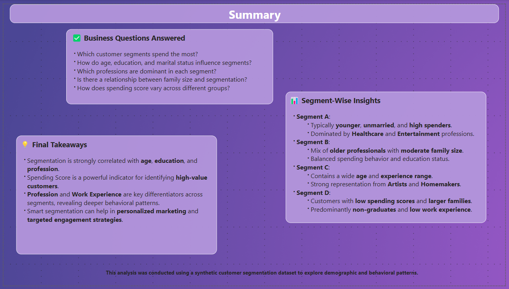

# 🛍️ Customer Segmentation Power BI Report

## 🔍 Objective:
Analyze customer demographics, spending behavior, and segmentation to uncover actionable insights for targeted marketing.

---

## 📑 Report Pages

### 1️⃣ Customer Overview
- **Goal**: Snapshot of overall customer demographics and segment distribution.
- **KPIs**: Total Customers, Avg Age, Avg Work Experience, Most Common Segment.
- **Visuals**:
  - Donut Chart: Segment Distribution
  - Bar Chart: Segment by Gender, Marital Status, Graduation Status
  - Slicers: Segment, Gender

---

### 2️⃣ Customer Demographic Overview
- **Goal**: Understand age, profession, and family characteristics by segment.
- **Visuals**:
  - Histogram: Age Bins by Segment
  - Stacked Bar: Profession by Segment
  - Stacked Bar: Family Size by Segment

---

### 3️⃣ Work Experience Trends Across Professions
- **Goal**: Analyze profession distribution and work experience trends by segment.
- **Visuals**:
  - Bar Chart: Profession by Customer Count
  - Line Chart: Avg Work Experience by Segment
  - Matrix: Profession by Segment with Conditional Formatting

---

### 4️⃣ Customer Spending Overview
- **Goal**: Explore spending behavior across segments and professions.
- **Visuals**:
  - Pie Chart: Spending Score Distribution
  - Bar Chart: Segment by Spending Score
  - Matrix: Spending Score by Profession
  - KPI: Segment with Most High Spenders

---

### 5️⃣ Family Size & Category Overview
- **Goal**: Investigate family structure and customer category .
- **Visuals**:
  - Bar Chart: Segment by Family Size
  - Matrix: Family Size by Spending Score
  - Bar Chart: Segment by Category
  - KPIs: Most Common Family Size, Segment with Largest Families

---

### 6️⃣ Smart Insights (Page 1)
- **Goal**: Discover hidden trends and patterns using advanced visuals.
- **Visuals**:
  - Scatter Plot: Age vs. Work Experience by Segment
  - KPI Cards: Outlier Count, Profession with Highest Avg Age, Segment with Widest Family Size Spread
  - Table: Top Professions by Avg Family Size

---

### 7️⃣ Smart Insights (Page 2)
- **Visual**: Decomposition Tree
- **Purpose**: Drill down from Segment to Profession to Spending Score

---

### 8️⃣ Summary
- **Business Questions Answered**:
  - Which segments spend the most?
  - How do age, education, marital status affect segments?
  - What professions dominate each segment?
  - Any links between family size and segment?
  - How does spending vary by segment?

- **Segment-wise Insights**:
  - **Segment A**: Younger, unmarried, high spenders; dominated by Healthcare/Entertainment.
  - **Segment B**: Older professionals, moderate family size, balanced spending.
  - **Segment C**: Wide age/experience range; Artists and Homemakers.
  - **Segment D**: Low spending, large families, non-graduates.

- **Final Takeaways**:
  - Segments influenced by age, education, profession.
  - Spending Score = key to identifying high-value customers.
  - Work Experience and Profession = key behavioral indicators.

---

## 🧠 Skills Shown
- Power BI Data Modeling (Star Schema Design)
- Power Query (Data Cleaning, Null Handling etc.)
- DAX (Measures, KPIs, Ranking Logic.etc)
- Report Theming & UI Design
- Advanced Visuals (Decomposition Tree, Conditional Formatting, Scatter Plots)
- Insight-Driven Storytelling