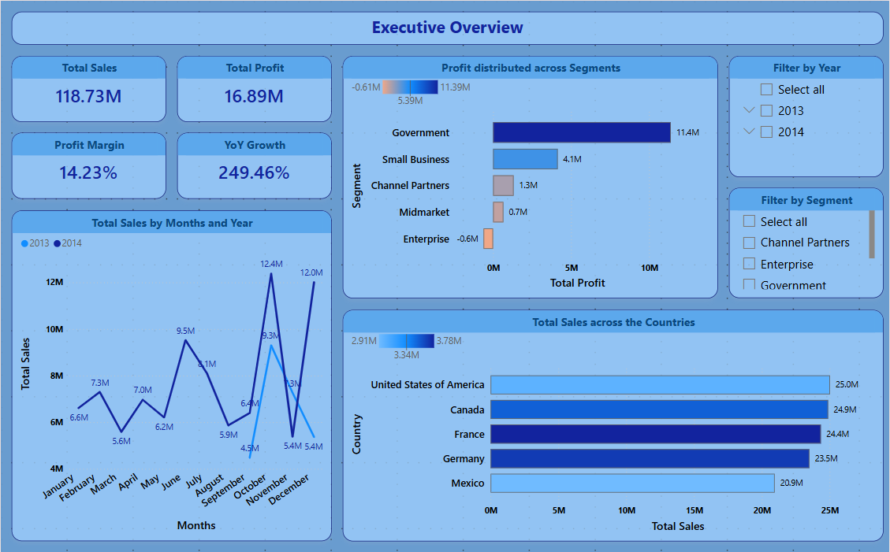
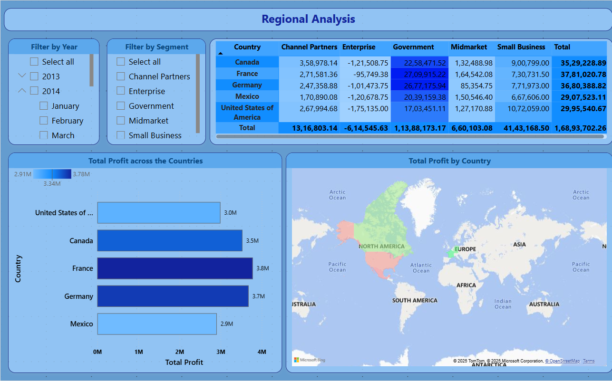
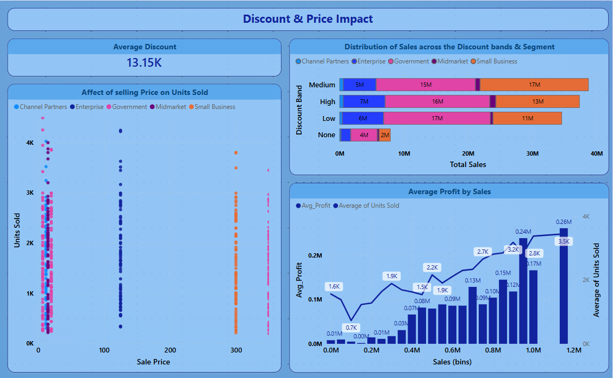
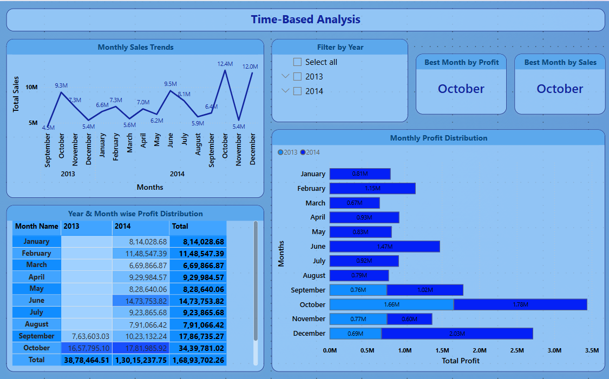
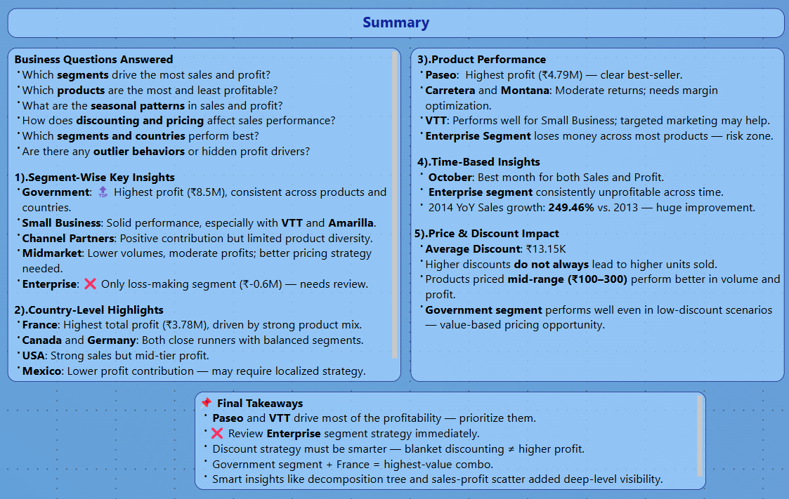

# 📊 Financial Sales Analysis Dashboard

This Power BI project explores a financial sales dataset to derive business insights across segments, countries, and time. It uses a clean star schema and interactive visuals to answer business-critical questions.

## 🧩 Key Features

- Star Schema Data Model
- 7-Page Report with KPIs & Deep-Dive Visuals
- Profit Drivers (Decomposition Tree, Scatter)
- Discount Analysis & Time Series Insights
- Conditional Formatting & Segmentation

## 📁 Folder Structure

```
Financial_Sales_Analysis_Dashboard/
│
├── data/
│   └── Financial_Sample.xlsx
│
├── images/
│   ├── 1.Sales_Performance_Overview.png
│   ├── 2.Segment_Country_Analysis.png
│   ├── 3.Product_Pricing_Impact.png
│   ├── 4.Discount_Cost_Impact.png
│   ├── 5.Segment_wise_Analysis.png
│   ├── 6.Time_Based_Performance.png
│   ├── 7.1.Smart_Insights_Page1.png
│   ├── 7.2.Smart_Insights_Page2.png
│   └── 8.Summary.png
│
├── Financial_Sales_Analysis_Report.pbix
├── Report_Structure.md
└── README.md
```

## 📷 Report Pages Preview

| Page | Overview |
|------|----------|
|  | **Sales Performance Overview** |
|  | **Segment & Country Analysis** |
|  | **Product Performance** |
|  | **Discounting & Price Impact** |
|  | **Segment wise Analysis** |
|  | **Time-Based Analysis** |
|  | **Smart Insights Page 1** |
|  | **Smart Insights Page 2** |
|  | **Summary & Final Takeaways** |

## 🛠 Tools Used

- Power BI Desktop
- Power Query (ETL)
- DAX Measures & KPIs
- Excel for data source

---

> ✅ Built with attention to data modeling, visual storytelling, and actionable insights.