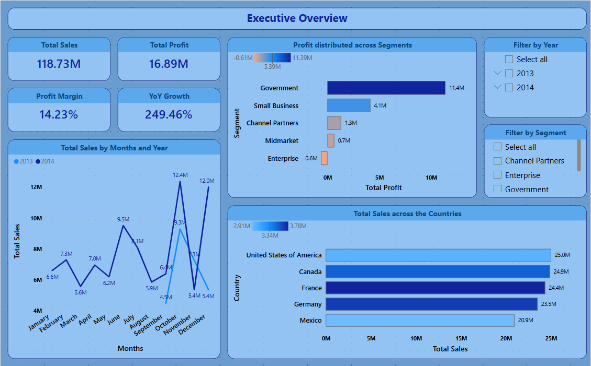
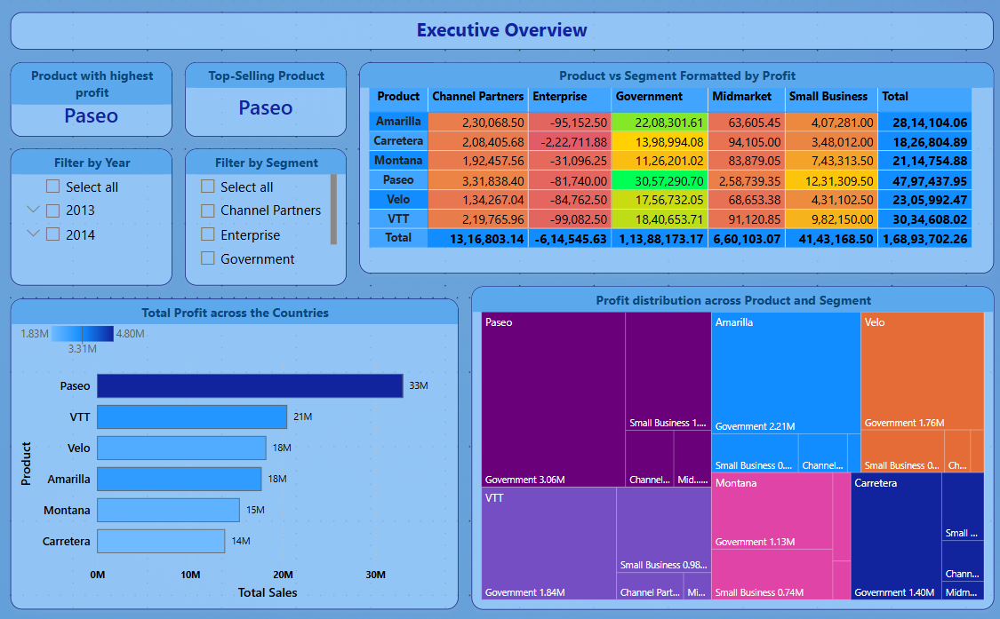
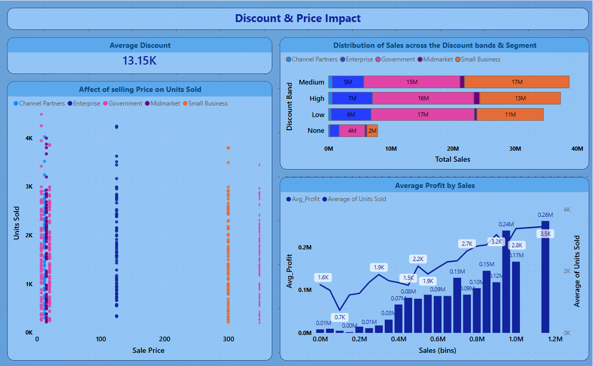
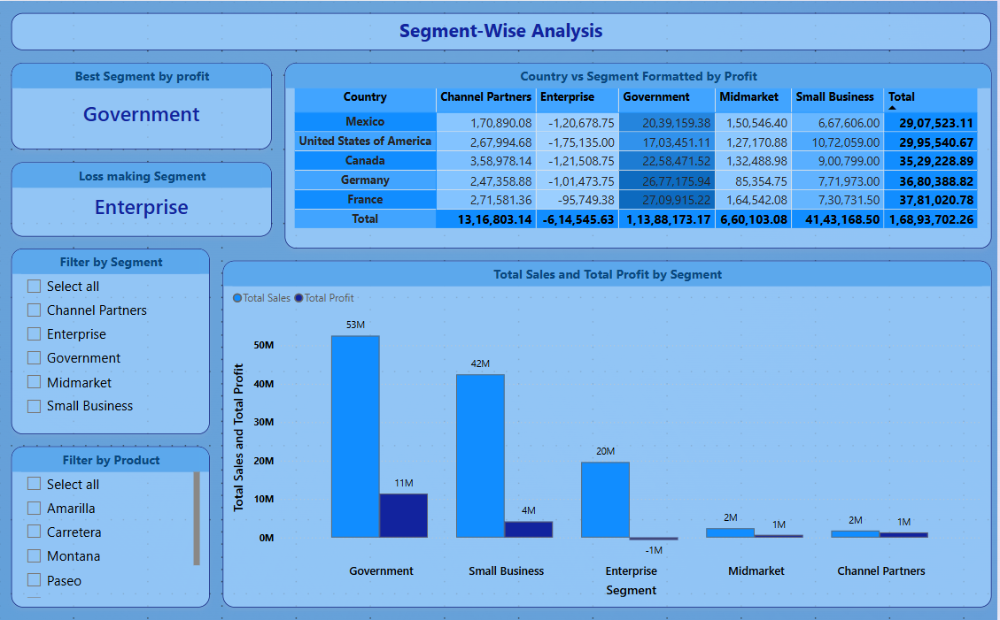
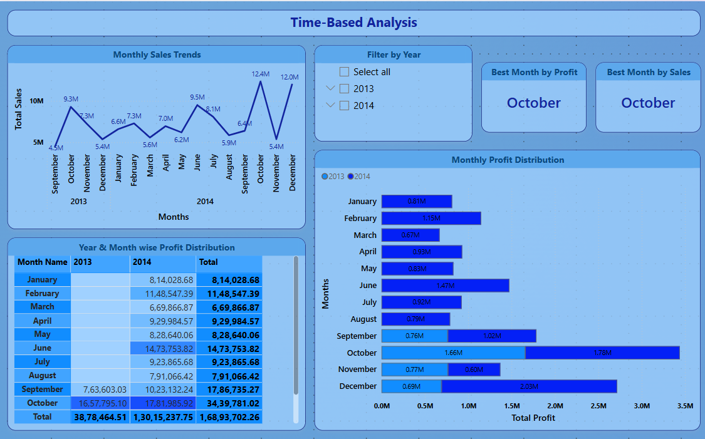
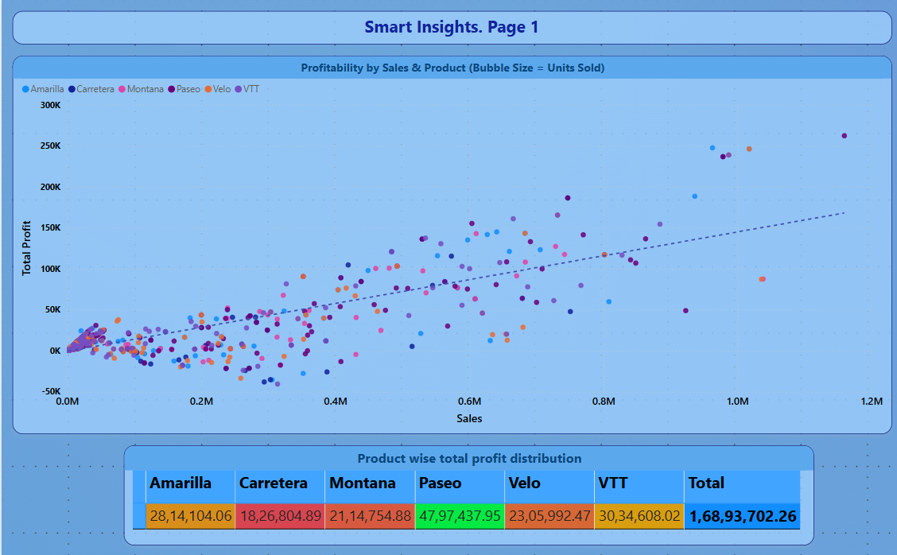
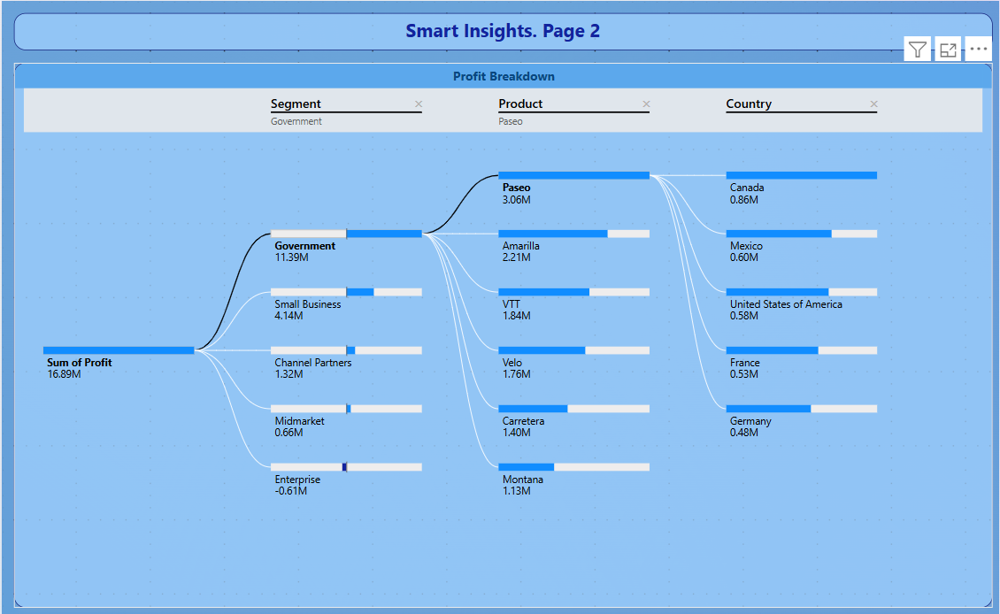
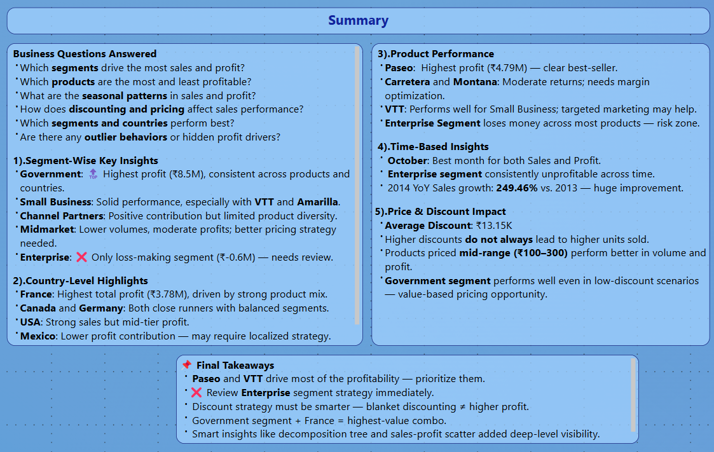

# 📊 Financial Sales Analysis - Report Structure

## 📌 Page 1: Sales Performance Overview

- **Purpose**: Understand key financial metrics and trends.
- **Visuals**:
  - KPIs: Total Sales, Total Profit, Units Sold, Profit Margin
  - Line Chart: Sales over Time
  - Column Chart: Sales & Profit by Segment
- **Image**: 

---

## 🌍 Page 2: Regional Analysis

- **Purpose**: Analyze sales & profit across segments and regions.
- **Visuals**:
  - Clustered Bar: Sales by Segment & Country
  - Matrix: Profit across Country-Segment combinations
  - KPIs: Top Segment / Country by Profit
- **Image**: 

---

## 📦 Page 3: Product Performance

- **Purpose**: Evaluate product-level performance and pricing impact.
- **Visuals**:
  - Bar: Gross Sales by Product
  - Matrix: Product vs Profit
  - Line Chart: Sale Price vs Units Sold
- **Image**: 

---

## 💰 Page 4: Discounting & Price Impact

- **Purpose**: Investigate how discounts and costs influence margins.
- **Visuals**:
  - Bar Chart: Discounts by Product
  - Matrix: Discount Band vs Segment
  - Line Chart: Discount vs Profit
- **Image**: 

---

## 📊 Page 5: Segment-Wise Analysis

- **Purpose**:Understand profitability and sales distribution across different customer segments and countries.

- **Visuals**:
- **KPI Cards**:
  - Best Segment by Profit → 🟩 **Government**
  - Loss-Making Segment → 🟥 **Enterprise**
- **Image**: 

---

## 📅 Page 6: Time-Based Performance
- **Purpose**: Explore seasonal trends and performance across months/years.
- **Visuals**:
  - Line Chart: Sales Trend by Month
  - KPI: YoY Growth
  - Bar Chart: Monthly Profit Comparison
- **Image**: 

---

## 🧠 Page 7: Smart Insights (Profit Drivers)
- **Purpose**: Reveal hidden trends and drivers using AI-assisted visuals.
- **Visuals**:
  - Decomposition Tree: Profit Breakdown
  - Profit vs Gross Sales Range Chart
- **Images**:
  - 
  - 

---

## 📋 Page 8: Summary & Key Takeaways
- **Purpose**: Consolidate insights, business questions, and recommendations.
- **Visuals**:
  - Text summaries
  - Top Segments/Products/Countries Recap
- **Image**: 

---

## 🛠️ Skills Shown
- Power BI Desktop (Star Schema, DAX, Custom Measures)
- Data Modeling (Fact-Dim Structure)
- Data Cleaning & Transformation (Power Query)
- Business Intelligence Storytelling
- Visual Best Practices (Conditional Formatting, KPIs, Slicers)
