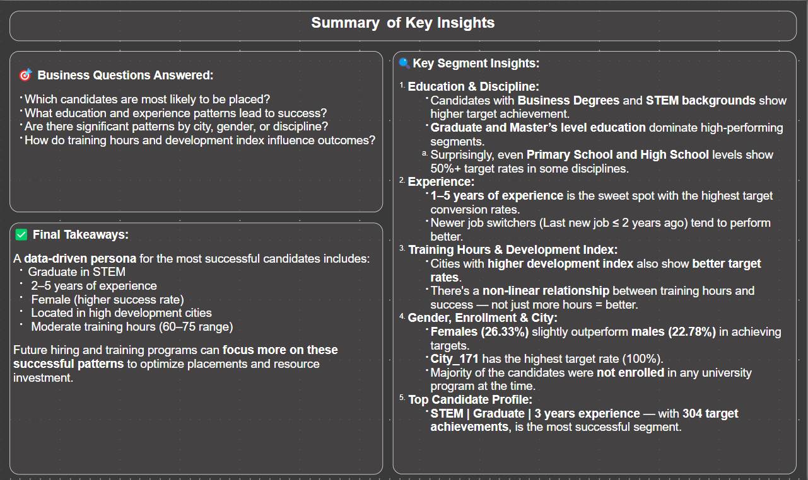

# 📊 HR Analytics – Job Change Prediction Dashboard

This Power BI dashboard analyzes HR data to uncover key insights into employee behavior, education, experience, and job change readiness. It helps understand **what drives job target achievement** and the **profile of likely successful candidates**.

---

## 📌 Business Goals

- Understand what factors contribute to job target readiness.
- Identify patterns in education, experience, and city development index.
- Build a profile of top-performing candidates.
- Help HR teams focus their upskilling and hiring strategies.

---

## 📷 Report Pages Overview

| Page | Visual | Description |
|------|-------------|--------|
| **1. Executive Overview** |  | Snapshot of employees, training, and target distribution |
| **2. Education & Discipline** |  | Explore how education level and major discipline influence success |
| **3. Experience & Job Change** |  | Analyze experience and job switch frequency with respect to target rate |
| **4. Gender, City & Enrollment** |  | Demographic-level insights: gender, city index, and enrollment types |
| **5. Target Prediction Profile** |  | What’s the most successful candidate profile? Education + Experience + Discipline |
| **6.1. Smart Insights-Page.1** |  | Scatter plots,  and advanced relationships between metrics |
| **6.2. Smart Insights-Page.2** |   | Decomposition tree |
| **7. Summary & Takeaways** |  | Business questions answered and segment-wise insights consolidated |

---

## 🧠 Key Questions Answered

- Which education levels or disciplines perform better?
- Does work experience correlate with target achievement?
- How does training hour investment impact placement readiness?
- What’s the profile of a high-performing employee?
- Are demographics like city, gender, or enrollment influencing readiness?

---

## 🧠 Skills Demonstrated

- 📌 **Data Modeling**: Star schema setup in Power BI
- 🧹 **Data Cleaning**: Power Query transformations & null handling
- 🧮 **DAX Measures**: KPI Cards, Custom Sorting, Aggregates
- 📊 **Visual Design**: Matrix, Decomposition Tree, Dynamic Titles
- 📈 **Advanced Analysis**: Scatter Plots, Persona Profiling
- 🧠 **Insight Storytelling**: Dashboard structured to answer business questions

---

## 📁 Folder Structure

```
HR_Analytics_Job_Change_Dashboard/
│
├── data/
│ └── HR_Analytics_Job_Change_Analysis.csv
│
├── images/
│ ├── 1.Executive Overview.png
│ ├── 2.Education & Discipline.png
│ ├── 3.Experience & Job Change Behavior.png
│ ├── 4.Gender City and Enrollment.png
│ ├── 5.Target Prediction Profile.png
│ ├── 6.Smart Insights (Optional Advanced).png
│ └── 7.Summary.png
│
├── HR_Analytics_Report.pbix
├── Report_Structure.md
└── README.md

```
---

## 📁 How to Use This

- Explore the `.pbix` file to examine the complete dashboard in Power BI.
- View embedded screenshots in this README for a quick preview.

---